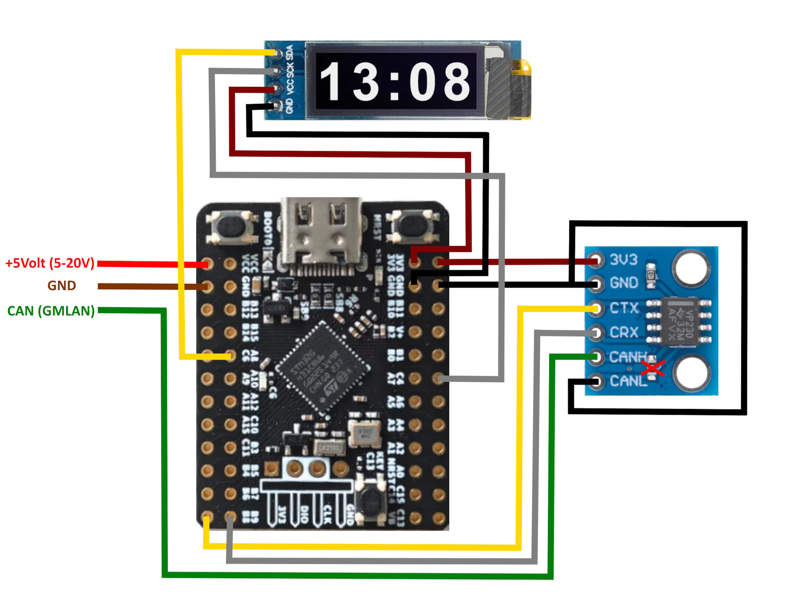
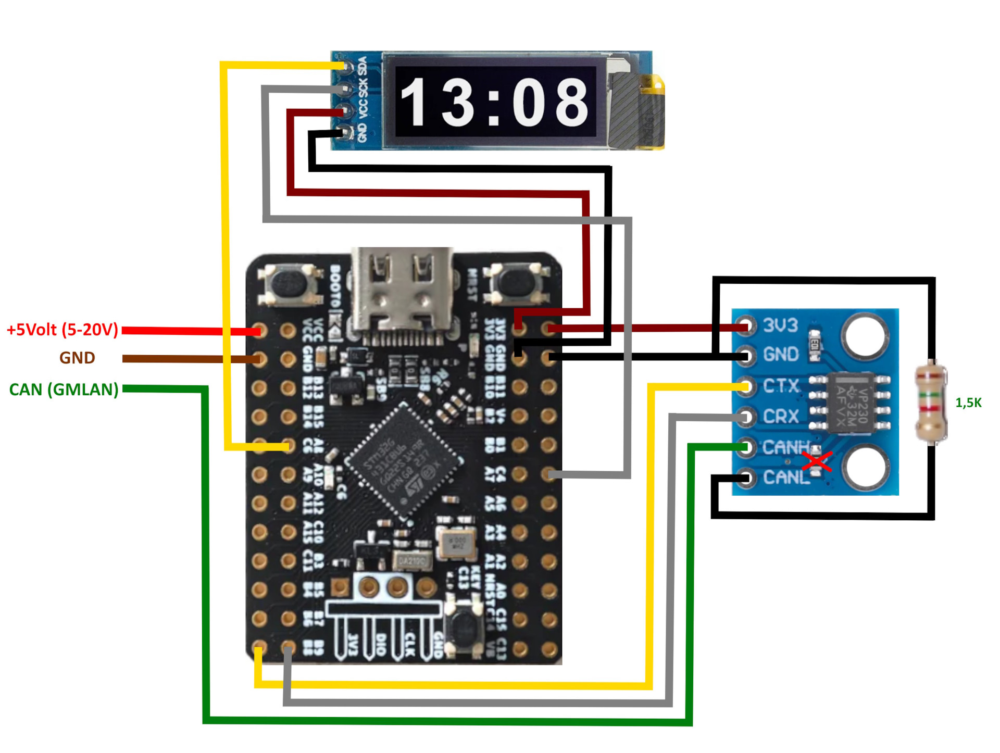
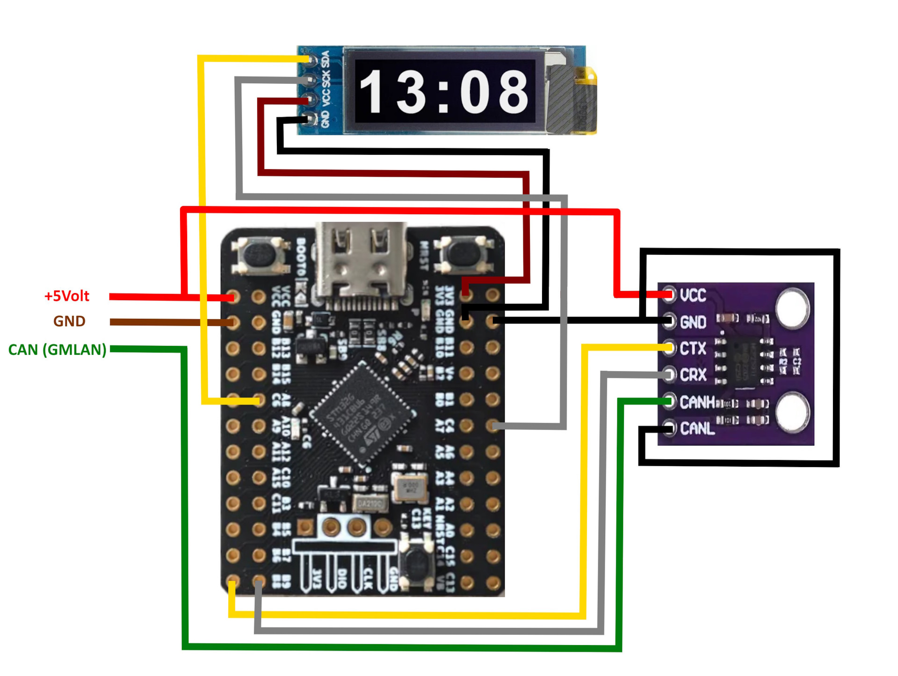
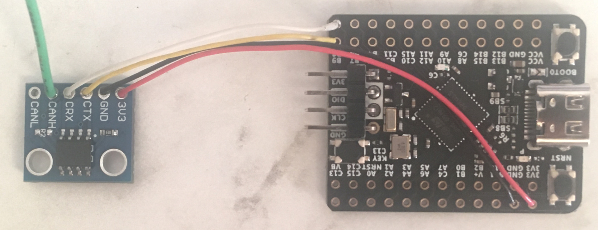
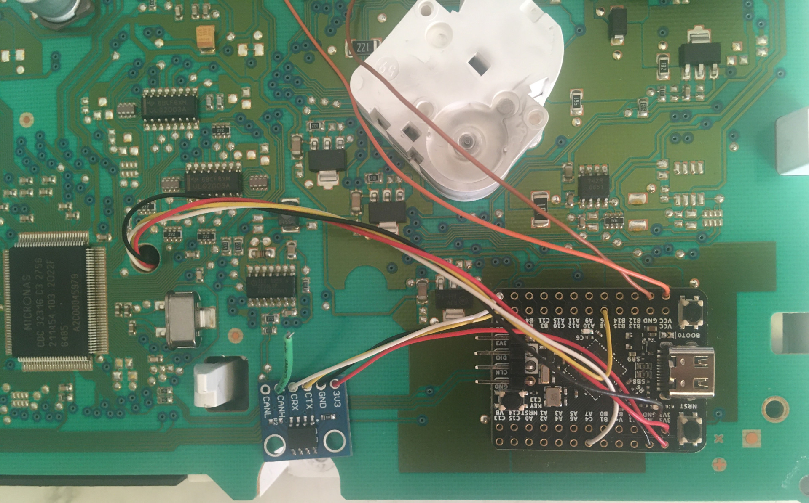
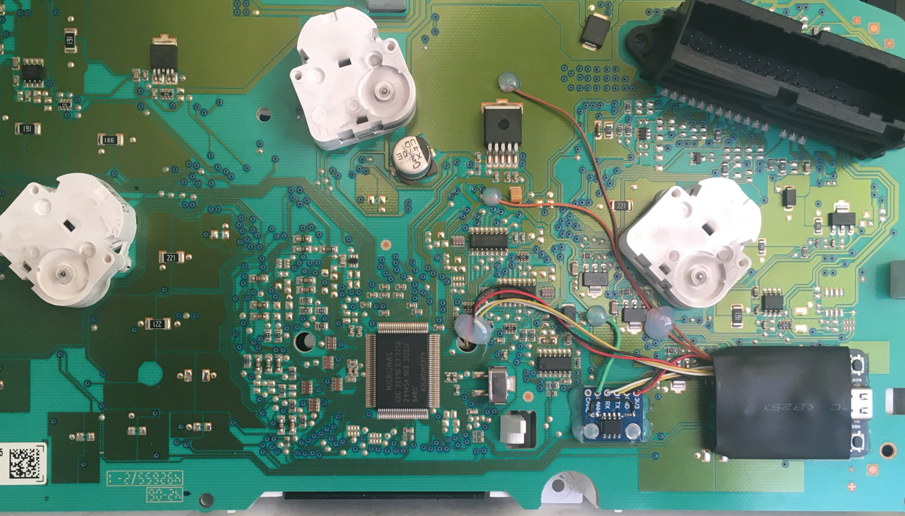
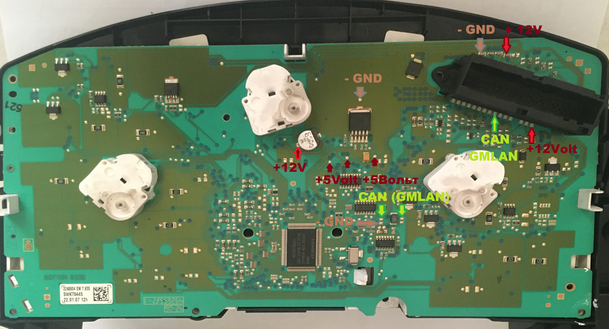

# Подключение доп. дисплея к IPC (пример 1)

Источник: [drive2.ru/l/677002845400073684](https://www.drive2.ru/l/677002845400073684/)

Ниже — аккуратно собранная инструкция с превью всех схем и фото.

## Превью изображений

### Варианты подключения CAN‑трансивера
| Вариант | Превью |
| --- | --- |
| Вариант 1 |  |
| Вариант 2 |  |
| Вариант 3 |  |
| Вариант 4 |  |

### Соединения и точки подключения
| Схема | Превью |
| --- | --- |
| CAN‑трансивер ↔ МК (1) |  |
| CAN‑трансивер ↔ МК (2) |  |
| Точки на плате приборки (1) |  |
| Точки на плате приборки (2) |  |
| Установка/размещение (1) |  |
| Установка/размещение (2) |  |

## Что потребуется
- Модуль микроконтроллера WeAct Studio STM32G431CBU6.
- Модуль CAN‑трансивера, например SN65HVD230.
- Дисплейный модуль OLED 0,91" (лучше желтый).
- Термоусадка диаметром 25 мм.
- Двусторонний скотч 3M.
- Светофильтр.
- Тонкие провода.

## Подготовка CAN‑трансивера
В модуле трансивера выпаять терминирующий резистор 120 Ом между CAN‑H и CAN‑L.

## Варианты подключения CAN‑трансивера

### Вариант 1 (SN65HVD230, 3.3 V)
Самый простой. CAN‑L подключается к GND модуля CAN. Возможны редкие падения шины при наличии доп. устройств.

### Вариант 2 (SN65HVD230, 3.3 V)
CAN‑L подключается через резистор 1.5 кОм к GND модуля CAN (вариант из сигнализаций).

### Вариант 3 (SN65HVD230, 3.3 V)
CAN‑L к GND, сам модуль подключается через изолирующий DC‑DC преобразователь.

### Вариант 4 (MCP2551, 5 V)

## Соединение модулей

### CAN‑трансивер ↔ микроконтроллер
- Pin B8 МК → CANRX
- Pin B9 МК → CANTX
- Питание на модуль CAN — по выбранной схеме

### Дисплей ↔ микроконтроллер
- Pin A8 МК → SDA
- Pin C4 МК → SCK
- Питание 3.3 V и GND с МК

## Подключение к приборной панели
Точки подключения на плате приборки:

Ключевые моменты:
- Всего три провода.
- Питание — от внутреннего стабилизатора +5 V.
- Если есть сомнения по нагрузке, подключайте МК к 12 V после защитных диодов.
- При питании от 12 V проверьте, что на плате МК стоит стабилизатор 5–20 V (маркировка UBWF).
- CAN‑H подключается к точке GMLAN (на фото отмечена зеленой стрелкой).
- Не забывайте про общий GND.

## Финальная сборка
- "Одеваем" плату микроконтроллера в термоусадку.
- Размещаем модули и фиксируем (скотч/термоклей).

## Вопросы и ответы (из обсуждения)

### Почему STM32F103C8T6 не подходит для вывода дверей на BID
- Состояние дверей в низкоскоростной шине, вывод на экран — в среднескоростной.
- В BID используются встроенные шрифты, изменить их нельзя.
- Реально выводить только цифры/текст, как на одометре (например, ESP off).

### Можно ли управлять вентилятором через эту плату
Нет. В приборке только низкоскоростная CAN. Управление вентилятором — на высокоскоростной (моторной) CAN, к ней проще подключаться через OBD.
