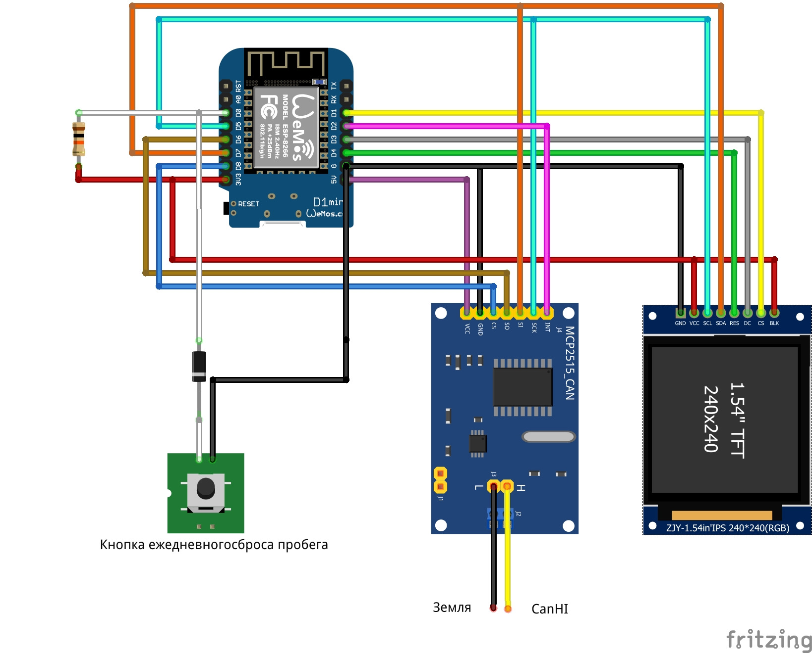
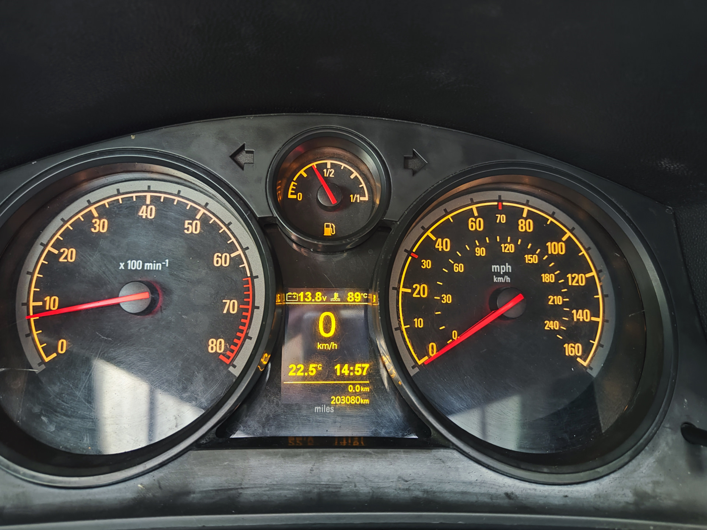
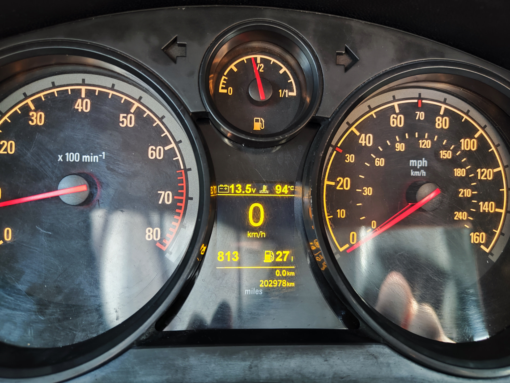

# Подключение дисплея к IPC на ESP8266 (пример 2)

Источник: [drive2.ru/l/706124235495462088](https://www.drive2.ru/l/706124235495462088/)
Источник: [drive2.ru/b/710626735611186757](https://www.drive2.ru/b/710626735611186757/)

Короткая инструкция по варианту с ESP8266 (Wemos D1 mini) и CAN‑модулем MCP2515.

## Превью изображений

| Фото | Превью |
| --- | --- |
| Схема подключения (1) |  |
| Схема подключения (2) |  |
| Схема подключения (3) |  |
| Дисплей 1 |  |
| Дисплей 2 |  |
| Дисплей ST7789 |  |
| MCP2515 |  |
| Экран Wi‑Fi/OTA |  |
| Питание от клеммы 15 |  |

## Железо
- Дисплей 2.4" ST7789.
- Контроллер: ESP8266 (Wemos D1 mini). Автор рекомендует использовать ESP32 в новых проектах.
- CAN‑модуль: MCP2515, подключение к LSCAN.
- Питание CAN‑модуля: строго 5 V.

## Логика работы и управление
- Кнопка сброса суточного пробега запускает режим обновления (OTA).
- Действие: в течение 15 сек после включения зажигания нажать и удерживать кнопку ~3 сек.
- При обновлении устройство пытается подключиться к роутеру; если не удалось — поднимает точку доступа.
- Кнопка также используется для переключения вариантов отображения.
- Альтернативно OTA можно запустить удержанием левой крутилки на руле вверх ~5 сек (также в течение 15 сек после включения зажигания).

## Яркость
- Для изменения яркости подсветки дисплея пин BL подключается к пину RX ESP8266.

## ПО и библиотеки
- Дисплей: TFT_eSPI — https://github.com/Bodmer/TFT_eSPI
- CAN: MCP2515 CAN interface library — https://github.com/autowp/arduino-mcp2515
- CAN‑ID база: https://github.com/megadrifter/Car-CAN-Message-DB

## Подключение для проверки через OBD‑разъем
- Контакт 1 — LSCAN High.
- Контакты 4 и 5 — земля.
- Контакт 16 — +12 V.
- LS‑CAN однопроводная, второй проводник — земля, поэтому земля питания должна быть общей с землей автомобиля.

## Прошивка и OTA
- Прошивка: основная часть с адреса `0x00000`, файловая система с адреса `0x200000`.
- Для прошивки упоминается Flash Download Tool (espressif).
- Имя точки доступа OTA — `Astra_H`, пароль — `12345678`.

## Возможности дисплея
- Скорость, температура двигателя, температура за бортом.
- Напряжение бортовой сети.
- Пробег и суточный пробег.
- Обороты двигателя, уровень топлива.
- Индикаторы дверей (для трехдверки).
- Индикация ручника с предупреждением при начале движения.
- Круиз‑контроль (скорость становится зеленой, для МКПП дублируется значком).
- Для изитроника/автомата — отображение передач и зимний режим.
- Для кабриолета — индикация процесса открытия/закрытия крыши.

## Примечания
- В статье упоминается EEPROM ST35080 (инкрементная часть с пробегом).