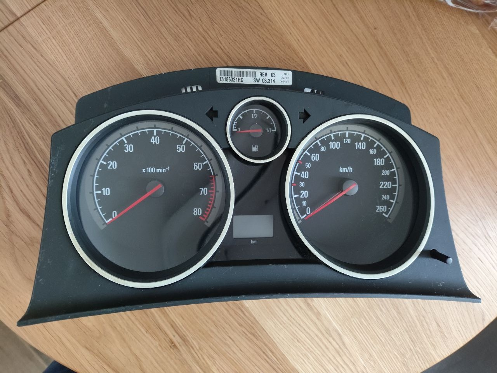
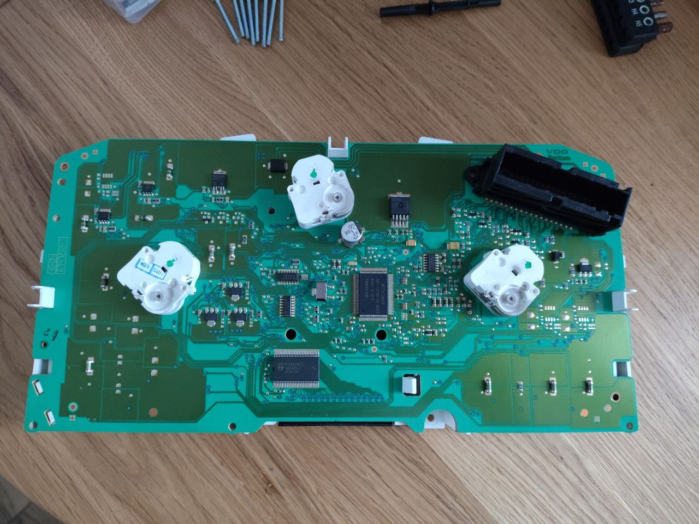
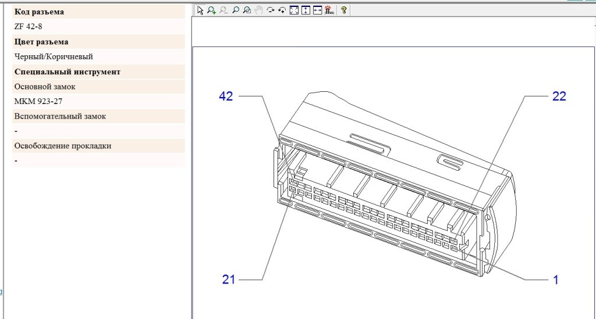
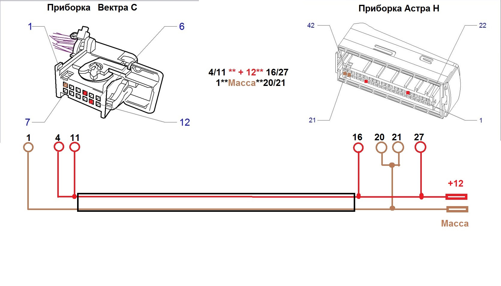

# Установка экрана в IPC Opel Astra H

## Иллюстрации

### Фото приборной панели

### Разъемы

### Схема питания

## Ссылки на первоисточники
- https://www.drive2.ru/l/706124235495462088/
- https://www.drive2.ru/l/677002845400073684/
- https://www.drive2.ru/l/698765479048662098/
- https://www.drive2.ru/b/710626735611186757/
- https://www.drive2.ru/l/708025565977778681/