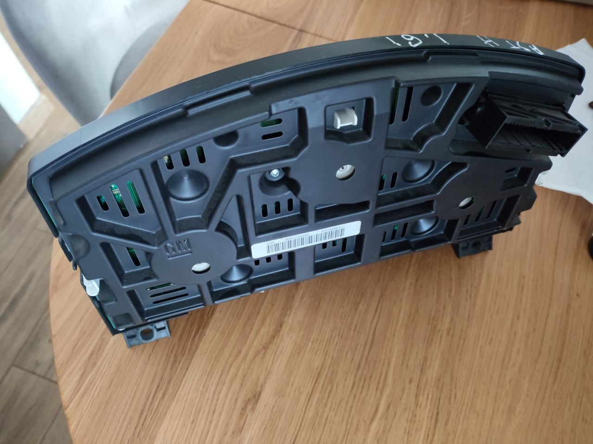
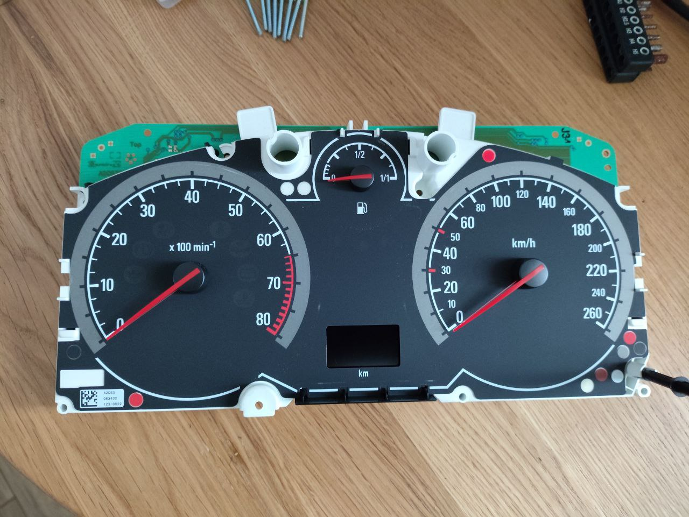
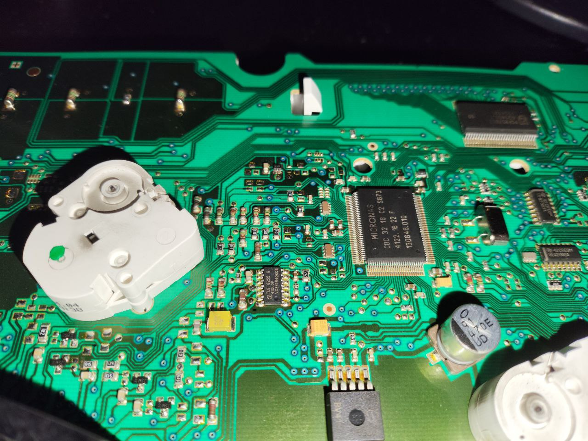
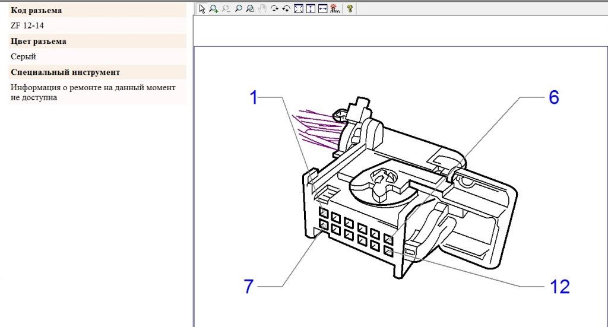

## Приборная панель (Opel Astra H / Opel Vectra C)

Краткая справка по приборной панели, разъемам и подключению на столе.  
Все изображения находятся в этой же папке.

### Описание приборки (Astra H)
- 13186321HC | SW 03.314 | REV 03 | 2004
- Бензиновая версия, МКПП.
- Комплектация одна из первых, много нераспаянных светодиодов (нет круиза, давление в шинах и т. д.).
- На приборке есть GMLAN (SW-CAN) со скоростью 33.3 kbit/s.
- Используется именно однопроводный SW-CAN.
- Трансивер на приборке: TLE6255G (маркировка VC341840K08).

### Фото приборной панели

### Пробег (EEPROM)
- EEPROM приборки: ST35080.
- В дампе есть VIN, тип приборки, Carpass и пробег.
- Пробег прописан в первой строке дампа; его можно править.
- В этом чипе пробег «вперёд» корректируется без проблем; «назад» — через замену/перепайку EEPROM.
- Дамп читали «обычным прогером 2010», калькулятор пробега — ETSmart (также упоминается iProg+).

**Видео по извлечению Carpass из EEPROM:**  
https://www.youtube.com/watch?v=ulA75HNp4PE&list=PLLUTlEXxNhgbbZScJmQedW8Meowykf3Z8&index=2

### Разъемы TIS (IPC plug-in)
- Opel Astra H — ZF 42-8
- Opel Vectra C — ZF 12-14

### Как подключить на столе
Подключаем питание согласно схеме/распиновке. После подачи питания панель остаётся в неактивном состоянии.

**Питание по схеме (opel_astra_h_ipc_power_schema.png):**
- Opel Astra H: +12 V — пины 16 и 27, масса — пины 20 и 21.
- Opel Vectra C: +12 V — пины 4 и 11, масса — пин 1.
Кратко по ориентирам: на схеме отмечены линии +12 (красный) и масса (коричневый), пины подписаны возле колодки.

### Как включить (нижний экран)
Активация нижнего экрана происходит при нажатии кнопки сброса суточного пробега.  
После подачи питания нажимаем кнопку суточного пробега — примерно через 10 секунд пробег отображается, затем экран отключается.

### Как пробудить всю приборку по CAN (GMLAN)
Для пробуждения всей приборки используется CAN (GMLAN).
**Что используется:** однопроводной CAN (GMLAN / SW‑CAN) 33.3 kbit/s.  
Подключение через CAN-Hacker: **CAN-Low** — к общей земле (авто и прибор), **CAN-High** — к линии GMLAN.  
В настройках выбирают 10 kbit/s (фактически устройство работает на 33.333 kbit/s).

**Как пробудить:** в Transmit задают пакет `170 3 55 55 55` и передают с периодом 500 мс.  
Подают питание на панель — она «просыпается» и загорается. Без этого пакета панель не пробуждается.  
(Пример: Opel Astra H/Zafira B)

**Ссылки:**
https://www.drive2.ru/b/586266747829499725/  
https://www.drive2.ru/b/586035300631850029/  
https://canhacker.ru/однопроводный-can-gmlan-33-3kbit/
